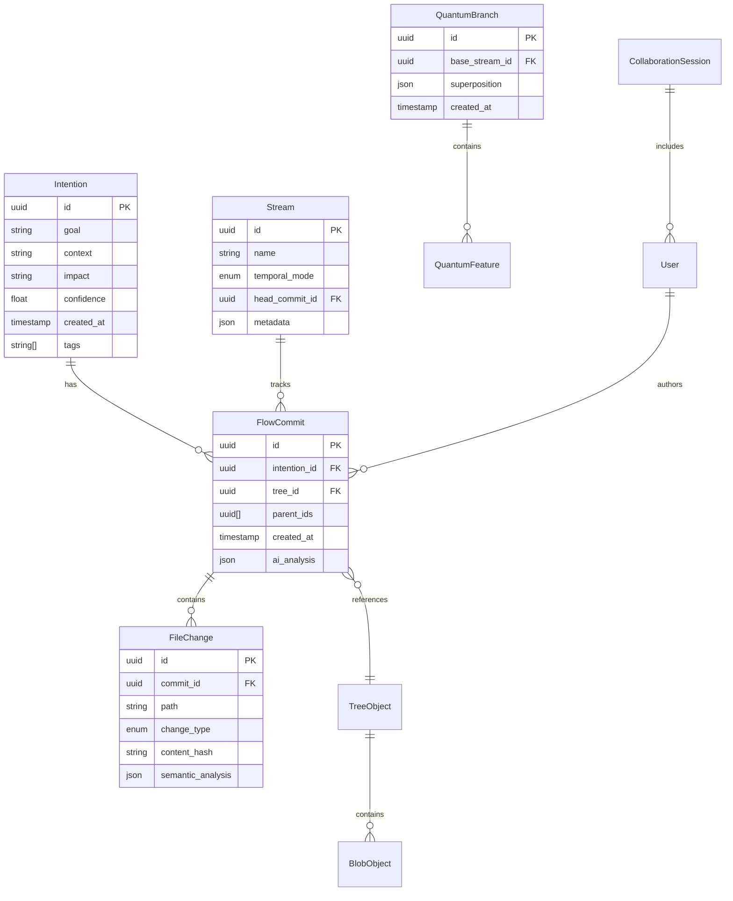
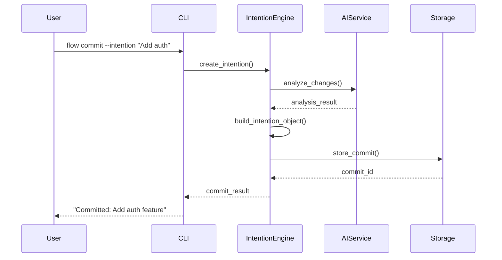
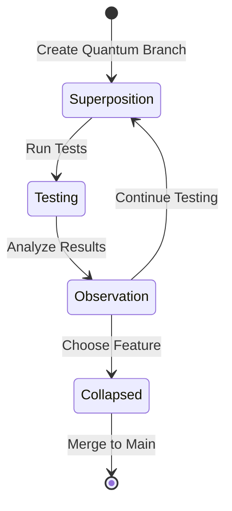

# FlowVersion 設計書

## 1. システムアーキテクチャ

### 1.1 全体アーキテクチャ

```
┌──────────────────────────────────────────────────────────┐
│                     User Interface Layer                   │
│  ┌─────────┐  ┌─────────┐  ┌─────────┐  ┌──────────┐   │
│  │   CLI   │  │   TUI   │  │   API   │  │  Web UI  │   │
│  └────┬────┘  └────┬────┘  └────┬────┘  └────┬─────┘   │
└───────┴─────────────┴─────────────┴──────────────┴───────┘
                              │
┌──────────────────────────────────────────────────────────┐
│                    Application Layer                       │
│  ┌──────────────┐  ┌──────────────┐  ┌──────────────┐   │
│  │   Command    │  │   Intention  │  │  Collaboration│   │
│  │   Handler    │  │   Engine     │  │     Engine    │   │
│  └──────────────┘  └──────────────┘  └──────────────┘   │
│  ┌──────────────┐  ┌──────────────┐  ┌──────────────┐   │
│  │   Stream     │  │    Quantum   │  │      AI       │   │
│  │   Manager    │  │   Branching  │  │   Service     │   │
│  └──────────────┘  └──────────────┘  └──────────────┘   │
└────────────────────────────────────────────────────────────┘
                              │
┌──────────────────────────────────────────────────────────┐
│                     Core Engine Layer                      │
│  ┌──────────────┐  ┌──────────────┐  ┌──────────────┐   │
│  │   Version    │  │   Conflict   │  │   Semantic   │   │
│  │   Control    │  │   Resolver   │  │   Analyzer   │   │
│  └──────────────┘  └──────────────┘  └──────────────┘   │
└────────────────────────────────────────────────────────────┘
                              │
┌──────────────────────────────────────────────────────────┐
│                    Storage Layer                           │
│  ┌──────────────┐  ┌──────────────┐  ┌──────────────┐   │
│  │   Object     │  │    Index     │  │   Metadata   │   │
│  │    Store     │  │   Manager    │  │     Store    │   │
│  └──────────────┘  └──────────────┘  └──────────────┘   │
└────────────────────────────────────────────────────────────┘
                              │
┌──────────────────────────────────────────────────────────┐
│                  Infrastructure Layer                      │
│  ┌──────────────┐  ┌──────────────┐  ┌──────────────┐   │
│  │  FileSystem  │  │   Network    │  │   External   │   │
│  │   Adapter    │  │   Protocol   │  │   AI APIs    │   │
│  └──────────────┘  └──────────────┘  └──────────────┘   │
└────────────────────────────────────────────────────────────┘
```

### 1.2 レイヤー責任

| レイヤー | 責任 | 主要コンポーネント |
|----------|------|-------------------|
| UI Layer | ユーザーインターフェース提供 | CLI, TUI, Web UI, API |
| Application Layer | ビジネスロジック実装 | Command Handler, Intention Engine |
| Core Engine Layer | コア機能の実装 | Version Control, Conflict Resolver |
| Storage Layer | データ永続化 | Object Store, Index Manager |
| Infrastructure Layer | 外部システム連携 | FileSystem, Network, AI APIs |

## 2. データモデル設計

### 2.1 エンティティ関係図



### 2.2 オブジェクトモデル

```yaml
# Intention Object
Intention:
  id: UUID
  goal: String          # 主目的
  context: String       # 背景・理由
  impact: String        # 影響範囲
  confidence: Float     # 0.0-1.0
  author: Author
  timestamp: Timestamp
  tags: String[]
  related_intentions: UUID[]

# Commit Object  
FlowCommit:
  id: UUID
  intention: Intention
  changes: FileChange[]
  tree_hash: Hash
  parent_commits: UUID[]
  timestamp: Timestamp
  signature: Signature?
  ai_analysis: AIAnalysis?

# File Change Object
FileChange:
  path: Path
  change_type: Added|Modified|Deleted|Renamed|Copied
  content_hash: Hash
  previous_hash: Hash?
  semantic_analysis: SemanticAnalysis
  mode: FileMode

# Semantic Analysis
SemanticAnalysis:
  language: ProgrammingLanguage?
  functions_added: String[]
  functions_modified: String[]
  functions_removed: String[]
  imports_changed: String[]
  complexity_change: Integer
  risk_score: Float
```

## 3. モジュール設計

### 3.1 ディレクトリ構造

```
flowversion/
├── src/
│   ├── main.rs              # エントリーポイント
│   ├── cli/                 # CLIインターフェース
│   │   ├── mod.rs
│   │   ├── commands.rs
│   │   └── handlers.rs
│   ├── core/                # コアエンジン
│   │   ├── mod.rs
│   │   ├── intention.rs
│   │   ├── commit.rs
│   │   ├── stream.rs
│   │   └── quantum.rs
│   ├── storage/             # ストレージ層
│   │   ├── mod.rs
│   │   ├── object_store.rs
│   │   ├── index.rs
│   │   └── cache.rs
│   ├── ai/                  # AI統合
│   │   ├── mod.rs
│   │   ├── service.rs
│   │   ├── analyzer.rs
│   │   └── predictor.rs
│   ├── collaboration/       # 協調機能
│   │   ├── mod.rs
│   │   ├── session.rs
│   │   └── consensus.rs
│   ├── network/             # ネットワーク
│   │   ├── mod.rs
│   │   ├── protocol.rs
│   │   └── sync.rs
│   └── utils/               # ユーティリティ
│       ├── mod.rs
│       ├── hash.rs
│       └── diff.rs
├── tests/                   # テスト
│   ├── integration/
│   └── unit/
├── docs/                    # ドキュメント
├── examples/                # サンプル
└── Cargo.toml              # 依存関係
```

### 3.2 主要インターフェース定義

```rust
// src/core/traits.rs

/// リポジトリ操作の基本インターフェース
pub trait Repository {
    async fn init(path: &Path) -> Result<Self>;
    async fn add_files(&self, files: &[&str]) -> Result<()>;
    async fn commit_with_intention(&self, intention: Intention) -> Result<CommitId>;
    async fn get_log(&self) -> Result<Vec<FlowCommit>>;
    async fn create_stream(&self, name: &str) -> Result<StreamId>;
    async fn merge_streams(&self, source: StreamId, target: StreamId) -> Result<()>;
}

/// AI サービスインターフェース
pub trait AIService {
    async fn analyze_changes(&self, changes: &[FileChange]) -> Result<AIAnalysis>;
    async fn suggest_intention(&self, changes: &[FileChange]) -> Result<IntentionSuggestion>;
    async fn predict_conflicts(&self, intention: &Intention) -> Result<Vec<ConflictPrediction>>;
    async fn suggest_reviewers(&self, intention: &Intention) -> Result<Vec<ReviewerSuggestion>>;
}

/// ストレージインターフェース
pub trait Storage {
    async fn store<T: Serialize>(&self, key: &str, value: &T) -> Result<()>;
    async fn load<T: DeserializeOwned>(&self, key: &str) -> Result<T>;
    async fn exists(&self, key: &str) -> bool;
    async fn delete(&self, key: &str) -> Result<()>;
    async fn list(&self, prefix: &str) -> Result<Vec<String>>;
}

/// 協調セッションインターフェース
pub trait CollaborationSession {
    async fn start(&self, participants: Vec<UserId>) -> Result<SessionId>;
    async fn broadcast_change(&self, change: LiveChange) -> Result<()>;
    async fn resolve_conflict(&self, conflict: Conflict) -> Result<Resolution>;
    async fn reach_consensus(&self, proposal: Proposal) -> Result<ConsensusResult>;
}
```

## 4. API設計

### 4.1 CLI コマンド体系

```bash
# 初期化
flow init [--name <name>] [--ai-mode <mode>]

# ファイル操作
flow add <files...> [--intention <text>]
flow rm <files...>
flow mv <source> <destination>

# コミット
flow commit --intention <text> [--context <text>] [--impact <text>] [--confidence <score>]
flow commit --ai-suggest  # AI が意図を提案

# 履歴
flow log [--oneline] [--graph] [--intentions]
flow show <commit-id>
flow diff [<commit-id>] [<commit-id>]

# ストリーム（ブランチ）
flow stream create <name> [--mode <linear|parallel|quantum>]
flow stream list
flow stream switch <name>
flow stream merge <source> [--ai-assist]

# 量子ブランチ
flow quantum create <name> --features <feature1,feature2,...>
flow quantum observe <name> --test-results <file>
flow quantum collapse <name> --choose <feature>

# 協調
flow collab start --participants <user1,user2,...>
flow collab join <session-id>
flow collab status

# AI機能
flow ai analyze [<files...>]
flow ai suggest-reviewers
flow ai predict-conflicts
```

### 4.2 内部API設計

```rust
// src/api/mod.rs

/// Flow Repository API
pub struct FlowAPI {
    repository: Box<dyn Repository>,
    ai_service: Box<dyn AIService>,
    storage: Box<dyn Storage>,
}

impl FlowAPI {
    /// 意図ベースコミット
    pub async fn commit_with_intention(
        &self,
        goal: String,
        context: Option<String>,
        impact: Option<String>,
        confidence: Option<f32>,
    ) -> Result<CommitResult> {
        // 1. ステージされた変更を取得
        let changes = self.repository.get_staged_changes().await?;
        
        // 2. AI分析（オプション）
        let ai_analysis = if self.ai_service.is_enabled() {
            Some(self.ai_service.analyze_changes(&changes).await?)
        } else {
            None
        };
        
        // 3. 意図オブジェクト作成
        let intention = Intention::new(goal, context, impact, confidence);
        
        // 4. コミット実行
        let commit_id = self.repository.commit_with_intention(intention).await?;
        
        Ok(CommitResult {
            commit_id,
            ai_analysis,
            suggestions: vec![],
        })
    }
    
    /// スマートマージ
    pub async fn smart_merge(
        &self,
        source: StreamId,
        target: StreamId,
    ) -> Result<MergeResult> {
        // 1. 両ストリームの意図を取得
        let source_intentions = self.repository.get_stream_intentions(source).await?;
        let target_intentions = self.repository.get_stream_intentions(target).await?;
        
        // 2. AI による互換性分析
        let compatibility = self.ai_service
            .analyze_merge_compatibility(&source_intentions, &target_intentions)
            .await?;
        
        // 3. 互換性に応じた処理
        match compatibility.score {
            s if s > 0.8 => {
                // 自動マージ
                self.repository.auto_merge(source, target).await
            }
            s if s > 0.5 => {
                // ガイド付きマージ
                Ok(MergeResult::NeedsGuidance(compatibility.guidance))
            }
            _ => {
                // 手動マージ必要
                Ok(MergeResult::ManualRequired(compatibility.conflicts))
            }
        }
    }
}
```

## 5. プロセスフロー設計

### 5.1 意図ベースコミットフロー



### 5.2 量子ブランチフロー



## 6. セキュリティ設計

### 6.1 セキュリティアーキテクチャ

```yaml
Security Layers:
  Transport:
    - TLS 1.3 for network communication
    - Certificate pinning for API calls
    
  Storage:
    - Optional AES-256 encryption for objects
    - SHA-256 for content hashing
    - Signature verification for commits
    
  Authentication:
    - SSH key support
    - GPG signature support
    - OAuth 2.0 for cloud features
    
  Authorization:
    - Role-based access control (RBAC)
    - Stream-level permissions
    - Audit logging
```

### 6.2 脅威モデル

| 脅威 | リスクレベル | 対策 |
|------|-------------|------|
| データ改ざん | 高 | ハッシュチェーン、署名検証 |
| 不正アクセス | 中 | 認証、暗号化 |
| AI API キー漏洩 | 高 | セキュアストレージ、環境変数 |
| 中間者攻撃 | 中 | TLS、証明書検証 |

## 7. パフォーマンス設計

### 7.1 最適化戦略

```rust
// キャッシング戦略
pub struct CacheStrategy {
    // LRU キャッシュ for オブジェクト
    object_cache: LruCache<ObjectId, Object>,
    cache_size: usize,  // デフォルト 1000 objects
    
    // AI 結果キャッシュ
    ai_cache: HashMap<CacheKey, AIResult>,
    ai_cache_ttl: Duration,  // デフォルト 1時間
    
    // インデックスキャッシュ
    index_cache: Arc<RwLock<IndexCache>>,
}

// 並列処理
pub struct ParallelProcessor {
    thread_pool: ThreadPool,
    worker_count: usize,  // CPU コア数 * 2
    
    // ファイル処理を並列化
    pub async fn process_files(&self, files: Vec<PathBuf>) -> Vec<FileChange> {
        files.par_iter()
            .map(|file| self.analyze_file(file))
            .collect()
    }
}

// メモリ管理
pub struct MemoryManager {
    max_memory: usize,  // デフォルト 512MB
    gc_threshold: f32,  // 0.8 (80%使用時にGC)
    
    pub fn check_memory_pressure(&self) -> bool {
        let current = self.get_current_usage();
        current > self.max_memory as f32 * self.gc_threshold
    }
}
```

### 7.2 ベンチマーク目標

| 操作 | 目標時間 | 条件 |
|------|----------|------|
| init | < 100ms | 空のリポジトリ |
| add | < 500ms | 1000ファイル |
| commit | < 2s | 1000ファイル変更 |
| log | < 200ms | 1000コミット |
| diff | < 100ms | 100ファイル変更 |
| AI分析 | < 3s | 100ファイル |

## 8. エラーハンドリング設計

### 8.1 エラー分類

```rust
// src/error.rs

#[derive(Debug, thiserror::Error)]
pub enum FlowError {
    // リポジトリエラー
    #[error("Repository not initialized")]
    RepoNotInitialized,
    
    #[error("Invalid repository state: {0}")]
    InvalidRepoState(String),
    
    // ストレージエラー
    #[error("Object not found: {0}")]
    ObjectNotFound(ObjectId),
    
    #[error("Storage error: {0}")]
    StorageError(#[from] StorageError),
    
    // AI エラー
    #[error("AI service unavailable")]
    AIServiceUnavailable,
    
    #[error("AI analysis failed: {0}")]
    AIAnalysisFailed(String),
    
    // ネットワークエラー
    #[error("Network error: {0}")]
    NetworkError(#[from] NetworkError),
    
    // 競合エラー
    #[error("Merge conflict in files: {0:?}")]
    MergeConflict(Vec<PathBuf>),
    
    // 量子ブランチエラー
    #[error("Quantum state already collapsed")]
    QuantumStateCollapsed,
}

// エラーリカバリー戦略
pub struct ErrorRecovery {
    pub fn handle_error(error: FlowError) -> RecoveryAction {
        match error {
            FlowError::AIServiceUnavailable => {
                RecoveryAction::Fallback(FallbackMode::LocalOnly)
            }
            FlowError::NetworkError(_) => {
                RecoveryAction::Retry { 
                    max_attempts: 3,
                    backoff: ExponentialBackoff::default()
                }
            }
            FlowError::StorageError(_) => {
                RecoveryAction::Repair
            }
            _ => RecoveryAction::Abort
        }
    }
}
```

## 9. テスト設計

### 9.1 テスト戦略

```yaml
Test Levels:
  Unit Tests:
    - Coverage Target: 80%
    - Focus: Core logic, utilities
    - Framework: Rust built-in test
    
  Integration Tests:
    - Coverage Target: 60%
    - Focus: Module interactions
    - Framework: Custom test harness
    
  E2E Tests:
    - Coverage Target: Critical paths
    - Focus: User workflows
    - Framework: CLI testing framework
    
  Performance Tests:
    - Benchmark suite for critical operations
    - Load testing for large repositories
    - Stress testing for concurrent operations
```

### 9.2 テストケース例

```rust
// tests/unit/intention_test.rs

#[cfg(test)]
mod tests {
    use super::*;
    
    #[test]
    fn test_intention_creation() {
        let intention = Intention::new(
            "Add authentication".to_string(),
            Some("Security requirement".to_string()),
            Some("Login system".to_string()),
            Some(0.9)
        );
        
        assert_eq!(intention.goal, "Add authentication");
        assert_eq!(intention.confidence, 0.9);
        assert!(!intention.tags.is_empty());
    }
    
    #[tokio::test]
    async fn test_ai_intention_analysis() {
        let mut ai_service = MockAIService::new();
        ai_service.expect_analyze_intention()
            .returning(|_| Ok(IntentionAnalysis {
                suggested_tags: vec!["security".to_string()],
                risk_score: 0.3,
                complexity: ComplexityLevel::Medium,
            }));
        
        let result = ai_service.analyze_intention(&test_intention()).await;
        assert!(result.is_ok());
    }
}

// tests/integration/commit_flow_test.rs

#[tokio::test]
async fn test_full_commit_flow() {
    let env = TestEnvironment::new().await;
    
    // 1. リポジトリ初期化
    let repo = Repository::init(env.temp_dir.path()).await.unwrap();
    
    // 2. ファイル作成
    env.create_file("main.rs", "fn main() {}").await;
    
    // 3. ステージング
    repo.add_files(&["main.rs"]).await.unwrap();
    
    // 4. 意図ベースコミット
    let commit = repo.commit_with_intention(
        Intention::new("Initial commit", None, None, None)
    ).await.unwrap();
    
    // 5. 検証
    assert!(!commit.id.is_empty());
    assert_eq!(commit.intention.goal, "Initial commit");
    assert_eq!(commit.changes.len(), 1);
}
```

## 10. デプロイメント設計

### 10.1 ビルド・リリース戦略

```yaml
Build Pipeline:
  stages:
    - lint:
        - cargo clippy
        - cargo fmt --check
    - test:
        - cargo test
        - cargo bench
    - build:
        - cargo build --release
        - cross-compile for targets
    - package:
        - create archives
        - generate checksums
    - release:
        - upload to GitHub Releases
        - publish to crates.io

Supported Platforms:
  - x86_64-unknown-linux-gnu
  - x86_64-apple-darwin
  - x86_64-pc-windows-msvc
  - aarch64-unknown-linux-gnu
  - aarch64-apple-darwin
```

### 10.2 配布方法

```bash
# インストール方法

# 1. Cargo経由
cargo install flowversion

# 2. Homebrew (macOS/Linux)
brew install flowversion

# 3. バイナリダウンロード
curl -L https://github.com/flowversion/releases/latest/download/flow-linux-x64 -o flow
chmod +x flow

# 4. Docker
docker run flowversion/flow:latest

# 5. ソースからビルド
git clone https://github.com/flowversion/flowversion
cd flowversion
cargo build --release
```

## 11. 移行戦略

### 11.1 Git からの移行

```rust
// src/migration/git.rs

pub struct GitMigrator {
    git_repo: git2::Repository,
    flow_repo: FlowRepository,
}

impl GitMigrator {
    pub async fn migrate(&self) -> Result<MigrationReport> {
        let mut report = MigrationReport::new();
        
        // 1. Git履歴の読み込み
        let commits = self.read_git_history()?;
        report.total_commits = commits.len();
        
        // 2. 各コミットを FlowCommit に変換
        for git_commit in commits {
            let flow_commit = self.convert_commit(git_commit).await?;
            self.flow_repo.import_commit(flow_commit).await?;
            report.migrated_commits += 1;
        }
        
        // 3. ブランチをストリームに変換
        let branches = self.git_repo.branches(None)?;
        for branch in branches {
            let stream = self.convert_branch_to_stream(branch?).await?;
            self.flow_repo.create_stream_from_import(stream).await?;
            report.migrated_branches += 1;
        }
        
        Ok(report)
    }
    
    async fn convert_commit(&self, git_commit: git2::Commit) -> Result<FlowCommit> {
        // Git コミットメッセージから意図を推論
        let intention = self.infer_intention_from_message(
            git_commit.message().unwrap_or("")
        ).await?;
        
        Ok(FlowCommit {
            id: CommitId::from_git_oid(git_commit.id()),
            intention,
            changes: self.extract_changes(&git_commit)?,
            tree_hash: TreeHash::from_git_tree(git_commit.tree()?),
            parent_commits: git_commit.parent_ids().map(|id| 
                CommitId::from_git_oid(id)
            ).collect(),
            timestamp: git_commit.time().seconds() as u64,
            ai_analysis: None, // 後から分析可能
        })
    }
}
```

## 12. 監視・運用設計

### 12.1 メトリクス収集

```rust
// src/metrics/mod.rs

pub struct MetricsCollector {
    // パフォーマンスメトリクス
    operation_durations: HashMap<String, Vec<Duration>>,
    
    // 使用統計
    command_usage: HashMap<String, usize>,
    ai_api_calls: usize,
    
    // エラー統計
    error_counts: HashMap<String, usize>,
}

impl MetricsCollector {
    pub fn record_operation(&mut self, name: &str, duration: Duration) {
        self.operation_durations
            .entry(name.to_string())
            .or_insert_with(Vec::new)
            .push(duration);
    }
    
    pub fn generate_report(&self) -> MetricsReport {
        MetricsReport {
            avg_operation_times: self.calculate_averages(),
            most_used_commands: self.get_top_commands(10),
            error_rate: self.calculate_error_rate(),
            ai_usage_stats: self.get_ai_stats(),
        }
    }
}
```

### 12.2 ログ設計

```rust
// src/logging/mod.rs

use tracing::{info, warn, error, debug};

pub struct Logger {
    pub fn setup() {
        tracing_subscriber::fmt()
            .with_env_filter(EnvFilter::from_default_env())
            .with_file(true)
            .with_line_number(true)
            .with_thread_ids(true)
            .with_target(false)
            .init();
    }
}

// ログレベル使用基準
// ERROR: 回復不能なエラー、データ損失の可能性
// WARN:  回復可能なエラー、パフォーマンス問題
// INFO:  重要な操作の完了、状態変更
// DEBUG: デバッグ情報、詳細な処理フロー
// TRACE: 非常に詳細なデバッグ情報

macro_rules! log_operation {
    ($level:expr, $op:expr, $details:expr) => {
        match $level {
            LogLevel::Error => error!("Operation failed: {} - {}", $op, $details),
            LogLevel::Warn => warn!("Operation warning: {} - {}", $op, $details),
            LogLevel::Info => info!("Operation: {} - {}", $op, $details),
            LogLevel::Debug => debug!("Operation debug: {} - {}", $op, $details),
        }
    };
}
```

## 13. 拡張性設計

### 13.1 プラグインアーキテクチャ

```rust
// src/plugin/mod.rs

#[async_trait]
pub trait Plugin {
    fn name(&self) -> &str;
    fn version(&self) -> &str;
    
    async fn on_init(&self, context: &mut PluginContext) -> Result<()>;
    async fn on_commit(&self, commit: &FlowCommit) -> Result<()>;
    async fn on_merge(&self, merge: &MergeEvent) -> Result<()>;
    
    fn register_commands(&self) -> Vec<PluginCommand>;
    fn register_hooks(&self) -> Vec<Hook>;
}

pub struct PluginManager {
    plugins: Vec<Box<dyn Plugin>>,
    hooks: HashMap<HookType, Vec<HookHandler>>,
}

impl PluginManager {
    pub async fn load_plugin(&mut self, path: &Path) -> Result<()> {
        // 動的ライブラリのロード
        let lib = unsafe { Library::new(path)? };
        let plugin = self.instantiate_plugin(lib)?;
        
        // プラグイン初期化
        let mut context = PluginContext::new();
        plugin.on_init(&mut context).await?;
        
        // コマンドとフックの登録
        for cmd in plugin.register_commands() {
            self.register_command(cmd);
        }
        
        for hook in plugin.register_hooks() {
            self.register_hook(hook);
        }
        
        self.plugins.push(plugin);
        Ok(())
    }
}
```

### 13.2 カスタムAIプロバイダー

```rust
// src/ai/provider.rs

#[async_trait]
pub trait AIProvider {
    async fn analyze(&self, prompt: &str) -> Result<String>;
    async fn complete(&self, prompt: &str) -> Result<String>;
    fn name(&self) -> &str;
    fn capabilities(&self) -> Vec<Capability>;
}

pub struct AIProviderRegistry {
    providers: HashMap<String, Box<dyn AIProvider>>,
    default_provider: String,
}

impl AIProviderRegistry {
    pub fn register(&mut self, provider: Box<dyn AIProvider>) {
        let name = provider.name().to_string();
        self.providers.insert(name, provider);
    }
    
    pub async fn analyze_with(&self, provider_name: &str, prompt: &str) -> Result<String> {
        self.providers
            .get(provider_name)
            .ok_or(FlowError::ProviderNotFound)?
            .analyze(prompt)
            .await
    }
}
```

## 14. 今後の拡張計画

### 14.1 ロードマップ

```yaml
Phase 1 (MVP - 2週間):
  - 基本的なリポジトリ操作
  - 意図ベースコミット
  - 簡単なAI統合
  - CLIインターフェース

Phase 2 (1-3ヶ月):
  - 量子ブランチング
  - スマートマージ
  - Git移行ツール
  - VSCode拡張

Phase 3 (3-6ヶ月):
  - リアルタイム協調
  - Web UI
  - クラウド同期
  - エンタープライズ機能

Phase 4 (6-12ヶ月):
  - 独自AI モデル
  - 分散型ストレージ
  - ブロックチェーン統合
  - マーケットプレイス
```

### 14.2 スケーラビリティ考慮事項

- **水平スケーリング**: 分散ストレージ対応
- **垂直スケーリング**: メモリ/CPU最適化
- **クラウドネイティブ**: Kubernetes対応
- **マイクロサービス化**: 機能の分離

---

この設計書により、FlowVersionの実装を開始できる準備が整いました。特に重要なのは：

1. **段階的実装**: MVPから始めて徐々に機能追加
2. **拡張性**: プラグインシステムで柔軟に機能追加
3. **テスタビリティ**: 各層が独立してテスト可能
4. **パフォーマンス**: キャッシュと並列処理で高速化